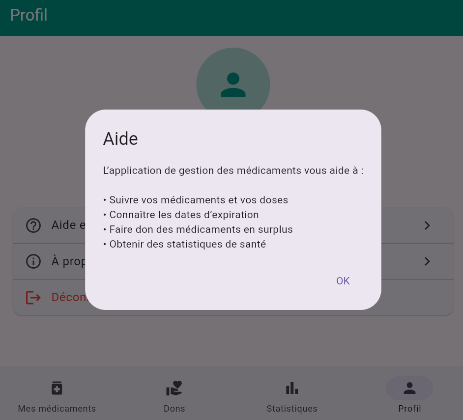
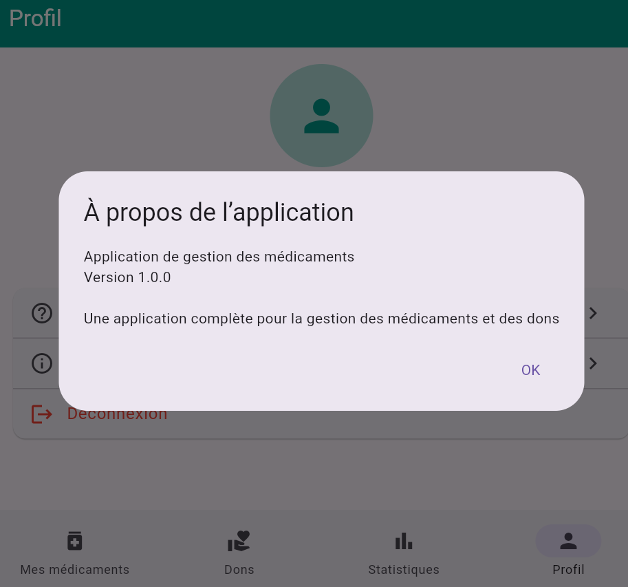
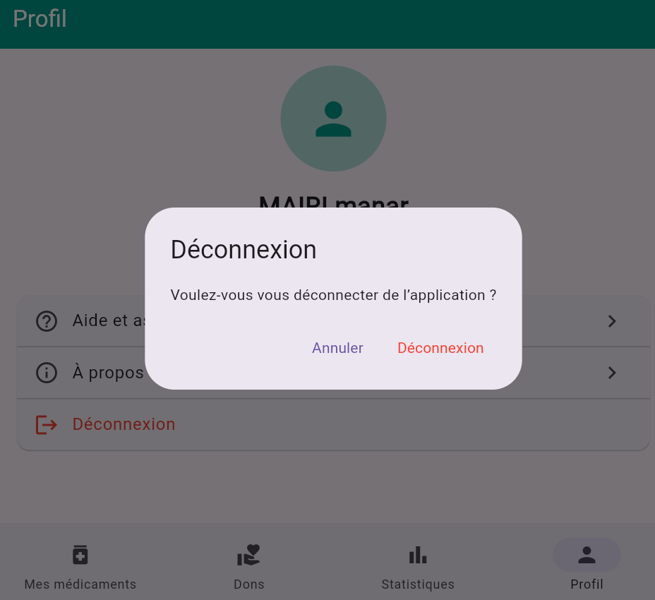

# 💊 Medicaments Flutter App

Application mobile développée avec **Flutter** permettant de gérer les médicaments personnels, suivre les prises quotidiennes et partager les médicaments non utilisés grâce à un système de dons.

---

# 📱 Aperçu

Application complète pour la **gestion des médicaments personnels** avec un **système intelligent de rappels** et une **plateforme de don de médicaments non utilisés**.

Elle aide les utilisateurs à :
- organiser leurs traitements
- suivre les doses prises
- recevoir des rappels importants
- partager les médicaments inutilisés avec d'autres personnes

---

# ✨ Fonctionnalités principales

## 🏥 Gestion des médicaments
- ✅ Ajouter et suivre facilement les médicaments  
- ✅ Enregistrer les doses quotidiennes  
- ✅ Suivre les doses restantes  
- ✅ Consulter les informations détaillées de chaque médicament  

## ⏰ Rappels et notifications
- 🔔 Notifications pour les horaires de prise des médicaments  
- ⚠️ Alertes pour les dates d’expiration  
- 📉 Notifications lorsque le stock est faible  

## 🤝 Système de dons
- 💚 Donner les médicaments non utilisés  
- 🔍 Rechercher les médicaments disponibles  
- 📍 Localisation et communication avec les donateurs  

## 📊 Statistiques et rapports
- 📈 Statistiques complètes sur les médicaments  
- 📅 Suivi de l’historique des prises  
- 📊 Analyse de l’utilisation des médicaments  

---

# 🛠️ Technologies utilisées

- **Flutter** — Framework de développement d’applications mobiles
- **Dart** — Langage de programmation principal
- **Firebase Authentication** — Gestion des comptes utilisateurs
- **Firebase Realtime Database** — Base de données en temps réel
- **Flutter Local Notifications** — Notifications locales
- **Material UI** — Interface utilisateur moderne
- **Intl** — Formatage des dates et heures

---

# 📸 Captures d'écran

## 🔐 Authentification

### Se connecter


### Créer un compte


---

## 💊 Gestion des médicaments

### Mes médicaments


### Ajouter un médicament


---

## 📊 Statistiques


---

## 🤝 Système de dons

### Liste des dons


### Ajouter un don


---

## 👤 Profil utilisateur






---

# ⚙️ Installation

### 1️⃣ Cloner le projet

```bash
git clone https://github.com/MAIRImanar/medicaments_flutter.git
