# Medicaments Flutter App

Application mobile développée avec Flutter permettant de gérer les médicaments personnels et de partager les médicaments inutilisés sous forme de dons.

---

## Fonctionnalités

✔ Ajouter un médicament  
✔ Suivre les doses consommées  
✔ Voir les statistiques des médicaments  
✔ Publier un don de médicament  
✔ Voir les dons disponibles  
✔ Contacter le donateur  
✔ Gestion du profil utilisateur  

---

## Technologies utilisées

- Flutter
- Dart
- Firebase
- Material UI

---

## Captures d'écran

### Se connecter
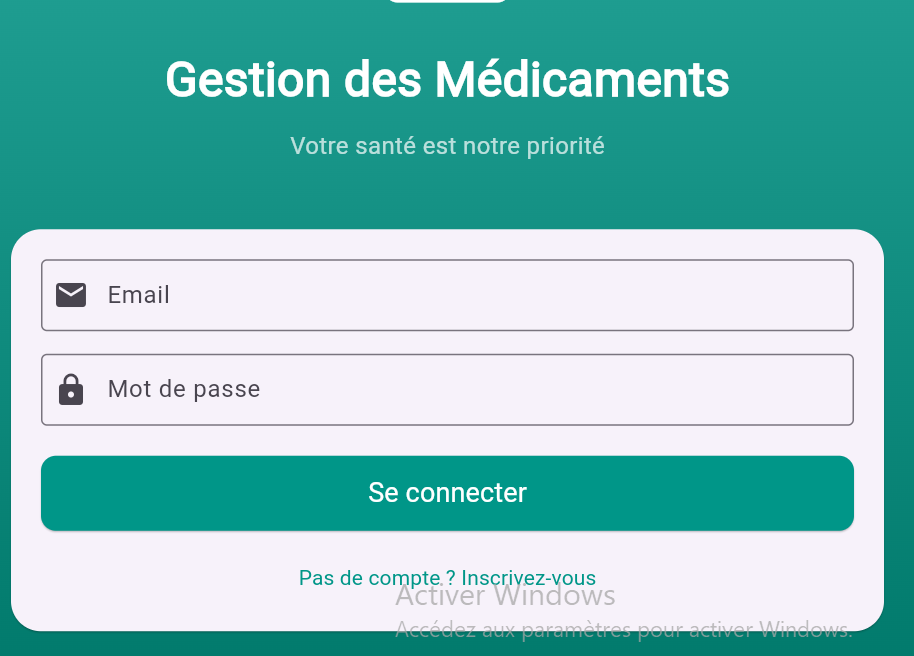

### Créer un compte
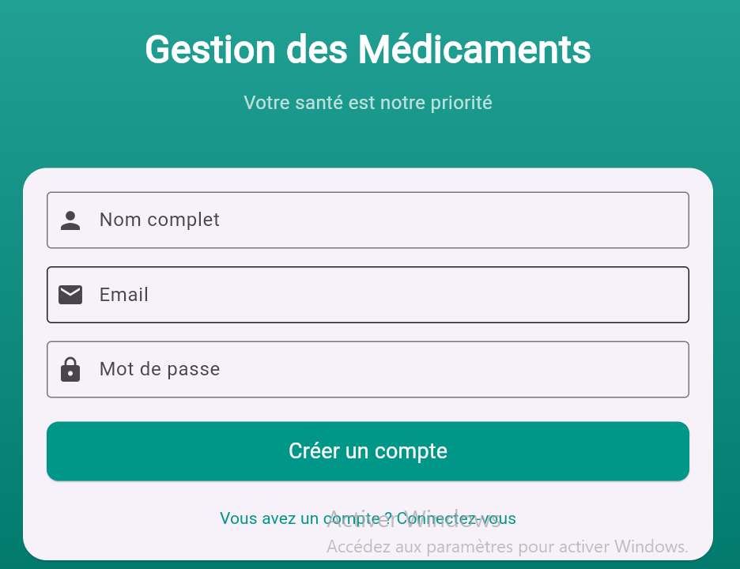

### Mes médicaments
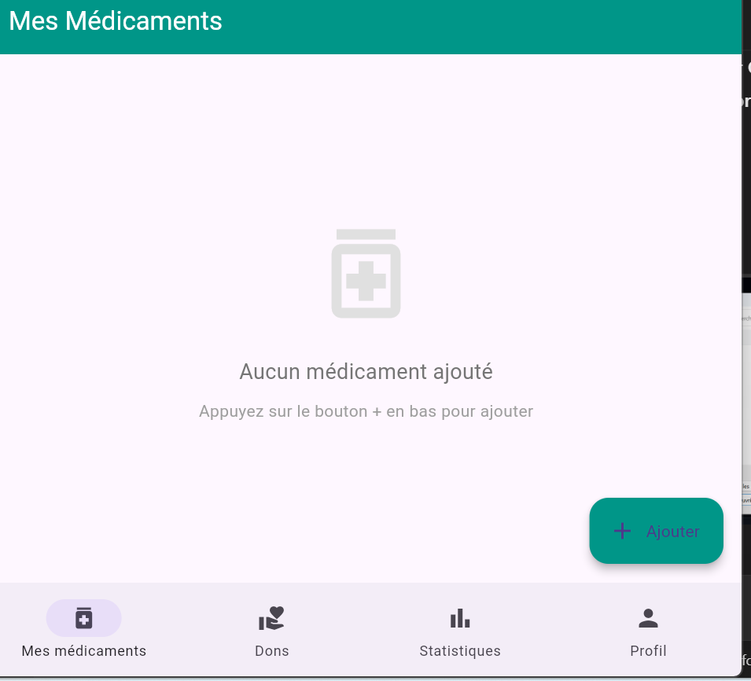

### Ajouter un médicament
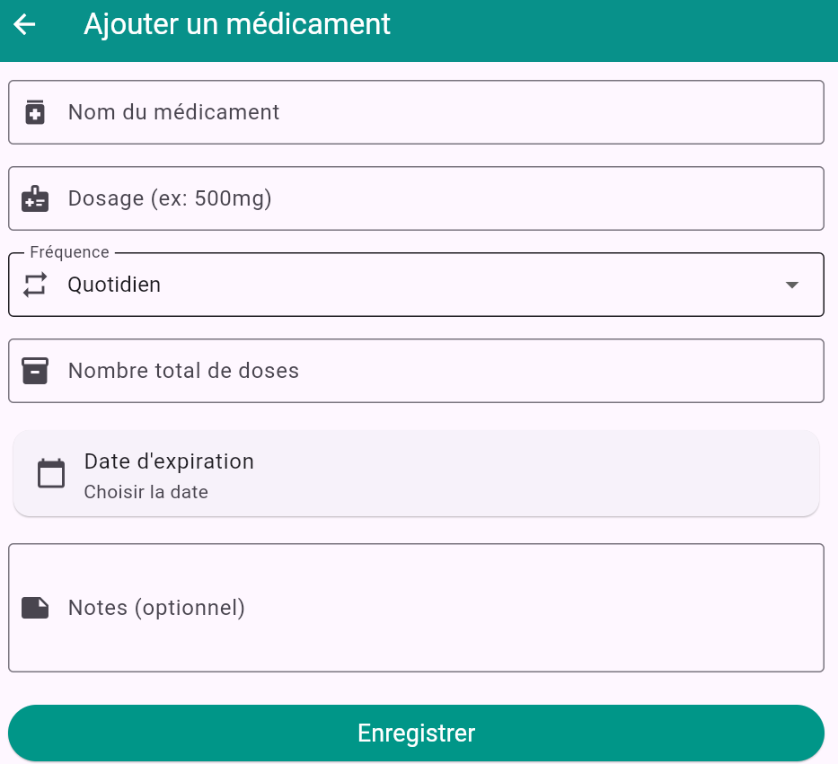
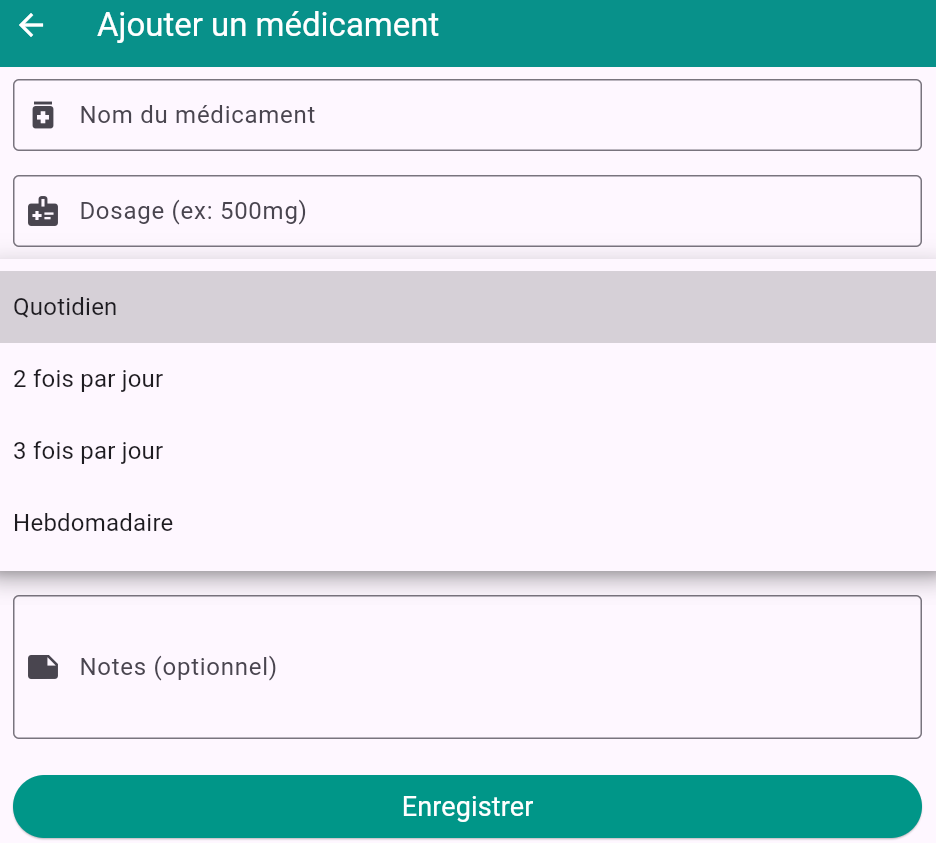
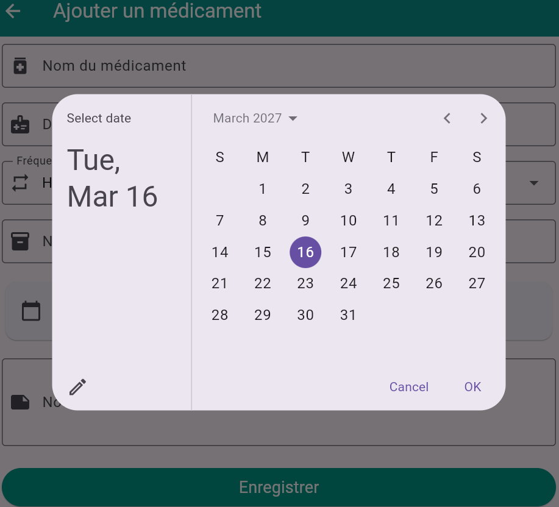

### Statistiques
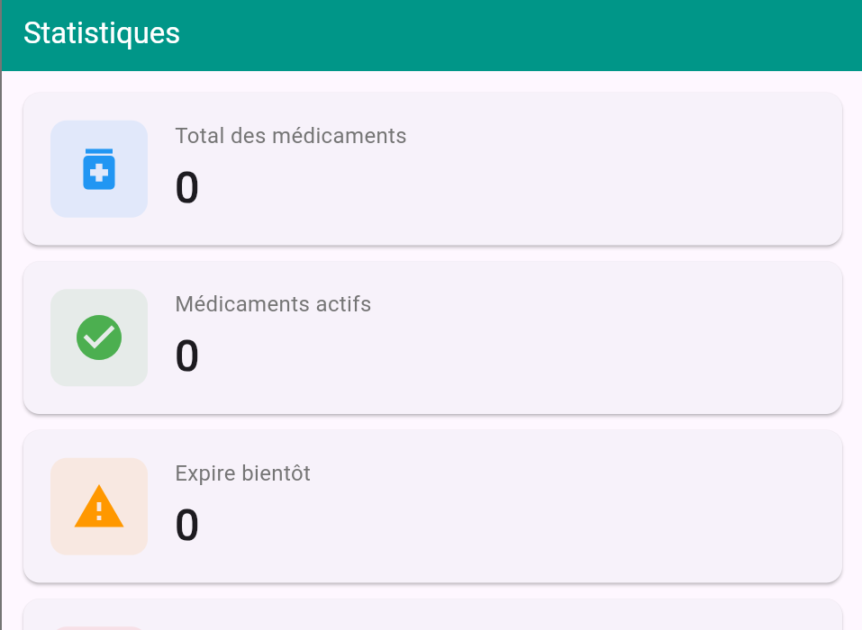
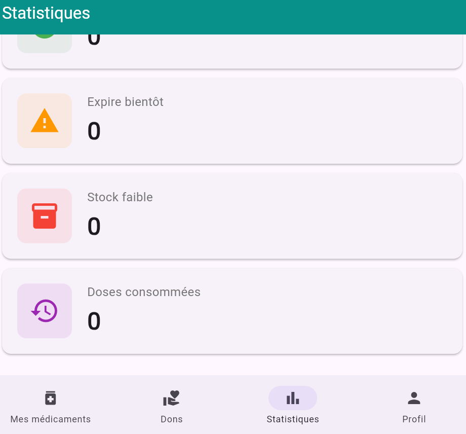

### Liste des dons
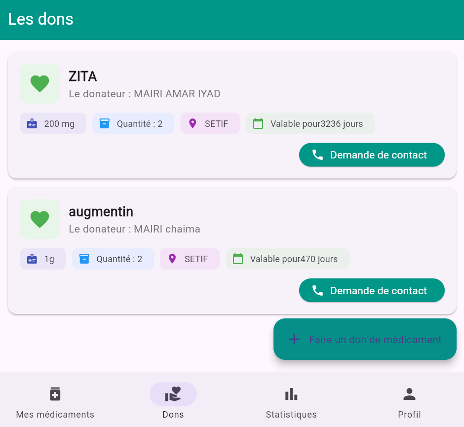

### Ajouter un don
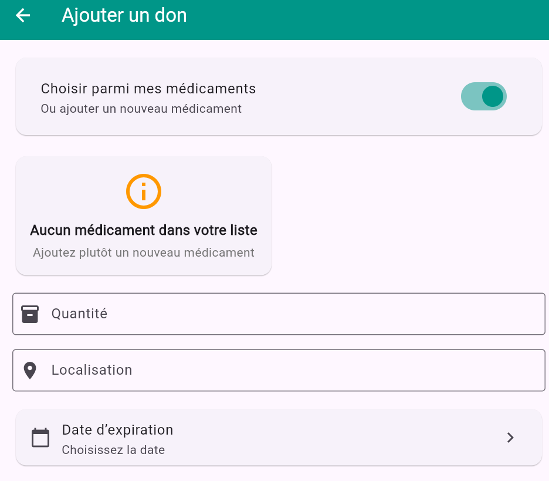
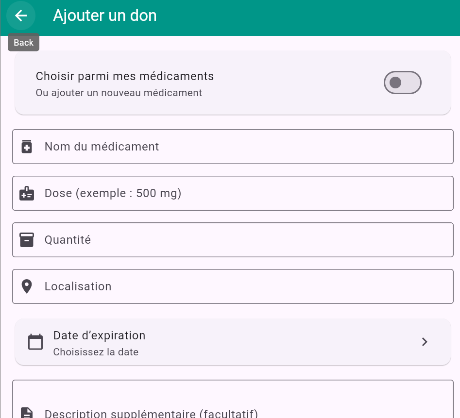
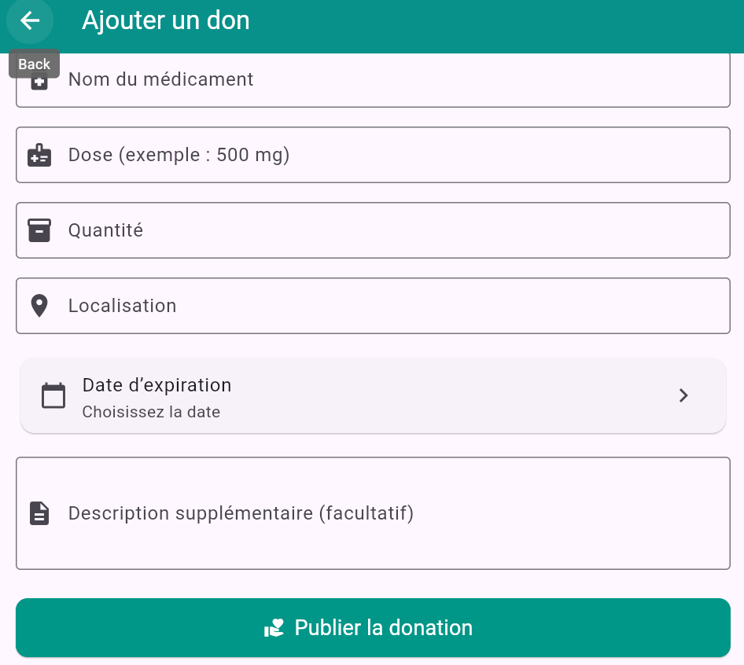

### Profil utilisateur
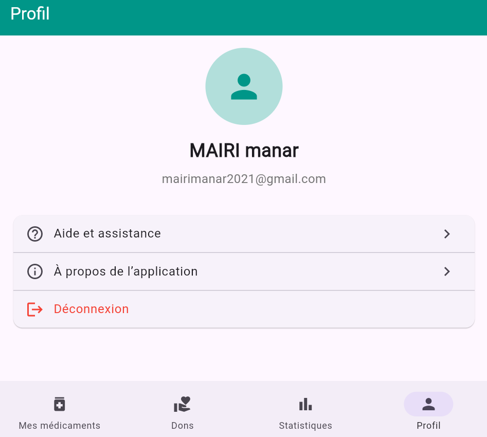

---

## Installation

Cloner le projet :

```bash
git clone https://github.com/MAIRImanar/medicaments_flutter.git
```

Entrer dans le dossier :

```bash
cd medicaments_flutter
```

Installer les dépendances :

```bash
flutter pub get
```

Lancer l'application :

```bash
flutter run
```

---

## Auteur

Projet réalisé par **Manar MAIRI**
